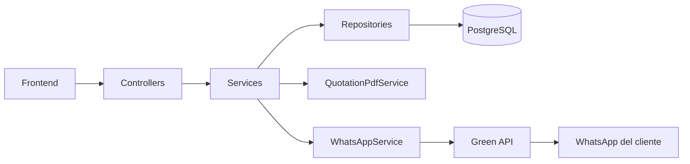

# Protec — Backend

API REST de **Protec**, un catálogo de equipos de videovigilancia (cámaras IP, DVR/NVR y accesorios) con cotizaciones que se envían al cliente por WhatsApp.

El frontend consume este backend para mostrar productos al público y para que un administrador gestione el catálogo.

## Stack

- Java 25
- Spring Boot 4.1
- Spring Web MVC, Spring Data JPA, Spring Security (JWT en cookie HttpOnly)
- PostgreSQL
- OpenPDF (generación de cotizaciones)
- Green API (envío de mensajes y archivos por WhatsApp)

## Para qué se usa

| Actor | Qué puede hacer |
| --- | --- |
| Visitante / cliente | Ver categorías y productos, crear una cotización con su nombre y teléfono |
| Administrador | Iniciar sesión, crear categorías, crear/editar/eliminar productos, listar cotizaciones |

Al crear una cotización el backend:

1. Guarda la cotización y sus ítems (con el precio vigente de cada producto).
2. Genera un PDF con los datos.
3. Envía el PDF por WhatsApp al teléfono del cliente (Green API).

## Arquitectura

El proyecto es un **monolito modular**: un solo deploy, paquetes separados por dominio. Cada módulo sigue capas clásicas de Spring.

```text
Cliente (navegador)
        │  HTTP + cookie JWT
        ▼
┌─────────────────────────────────────┐
│  Controllers  (/api/...)            │
│  DTOs + validación                  │
└──────────────┬──────────────────────┘
               ▼
┌─────────────────────────────────────┐
│  Services                           │
│  reglas de negocio                  │
└──────────────┬──────────────────────┘
               ▼
┌─────────────────────────────────────┐
│  Repositories (JPA)  →  PostgreSQL  │
└─────────────────────────────────────┘

Flujos extra:
  Cotización → QuotationPdfService → PDF
             → WhatsAppService     → Green API → WhatsApp
```



Convenciones de cada módulo:

| Capa | Responsabilidad |
| --- | --- |
| `controller` | HTTP, status codes, no lógica de negocio |
| `service` | Casos de uso, transacciones |
| `repository` | Acceso a datos |
| `domain` | Entidades JPA |
| `dto` | Contratos de entrada/salida |
| `mapper` | Entidad ↔ DTO |

La seguridad es **stateless**: login emite un JWT HS256 en cookie `HttpOnly`. Las rutas públicas no piden sesión; el resto exige rol `ADMIN`.

Errores de negocio, validación y 404 se unifican en `exception/GlobalExceptionHandler`.

## Módulos

Paquete base: `com.emz.protec`.

### `auth`

Login, logout y sesión actual (`/api/auth`). El token no viaja en el JSON: se guarda en cookie.

### `user`

Usuarios de la aplicación (`AppUser`) y rol `ADMIN`. Lo usa Spring Security para autenticar.

### `category`

Categorías del catálogo (Cámaras IP, DVR/NVR, Accesorios, etc.).

### `product`

Productos con nombre, categoría, precio, especificaciones y estado activo. Listado público paginado, con filtro por categoría y búsqueda. El borrado es lógico (`active = false`).

### `quotation`

Cotizaciones: cliente, teléfono e ítems. El precio unitario se congela al crear, para que un cambio posterior de catálogo no altere cotizaciones ya emitidas.

### `quotation.pdf`

Genera el PDF de una cotización (OpenPDF).

### `whatsapp`

Cliente HTTP hacia Green API: texto y documentos. Normaliza el teléfono a `chatId` (`51…@c.us` por defecto).

### `security`

JWT, cookie de autenticación y lectura del token desde la cookie (además del header `Authorization` si existiera).

### `config`

CORS, cadena de seguridad e inicialización de datos de ejemplo (productos seed si la tabla está vacía).

### `exception`

Excepciones de negocio / no encontrado y respuesta de error uniforme.

## API

Prefijo: `/api`.

### Públicas

| Método | Ruta | Descripción |
| --- | --- | --- |
| `POST` | `/api/auth/login` | Login; setea cookie JWT |
| `POST` | `/api/auth/logout` | Limpia la cookie |
| `GET` | `/api/products` | Listado paginado (`categoryId`, `search`, `page`, `limit`) |
| `GET` | `/api/products/{id}` | Detalle de producto |
| `GET` | `/api/categories` | Listado de categorías |
| `POST` | `/api/quotations` | Crear cotización y enviar PDF por WhatsApp |

### Administrador (cookie JWT, rol `ADMIN`)

| Método | Ruta | Descripción |
| --- | --- | --- |
| `GET` | `/api/auth/me` | Usuario autenticado |
| `POST` | `/api/products` | Crear producto |
| `PUT` | `/api/products/{id}` | Actualizar producto |
| `DELETE` | `/api/products/{id}` | Desactivar producto |
| `POST` | `/api/categories` | Crear categoría |
| `GET` | `/api/quotations` | Listar cotizaciones |

## Requisitos

- JDK 25
- Maven (o el wrapper `mvnw` / `mvnw.cmd`)
- PostgreSQL

## Cómo correrlo

1. Crear la base `protec` en PostgreSQL.
2. Copiar `.env.example` a `.env` y completar valores.
3. Arrancar:

```bash
./mvnw spring-boot:run
```

En Windows:

```bash
.\mvnw.cmd spring-boot:run
```

El frontend por defecto se espera en `http://localhost:5175` (CORS).

## Variables de entorno

Definidas en `.env` (no se versiona). Ver `.env.example`.

| Variable | Uso |
| --- | --- |
| `DB_URL`, `DB_USERNAME`, `DB_PASSWORD` | PostgreSQL |
| `JWT_SECRET` | Secreto HS256 (mínimo 32 caracteres) |
| `CORS_ALLOWED_ORIGINS` | Orígenes del frontend |
| `GREEN_API_ID_INSTANCE` | Id de instancia Green API |
| `GREEN_API_TOKEN` | Token de instancia |
| `GREEN_API_URL` | `apiUrl` del panel (incluye el cluster, p. ej. `https://XXXX.api.green-api.com`) |
| `GREEN_API_MEDIA_URL` | Host para subir archivos (`https://media.green-api.com`) |
| `GREEN_API_DEFAULT_COUNTRY_CODE` | Prefijo telefónico si el cliente envía 9 dígitos (`51` Perú) |

Si Green API no está configurada, la cotización se guarda igual y el envío por WhatsApp se omite (queda un warning en logs). Los valores de instancia salen de [console.green-api.com](https://console.green-api.com).
